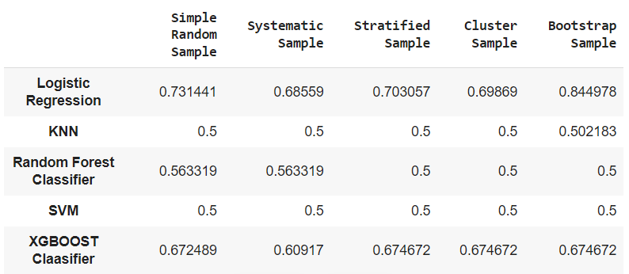
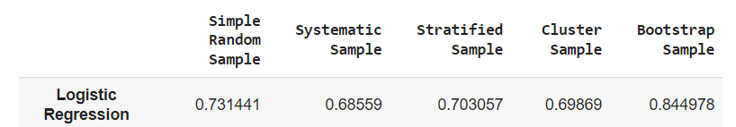

# Sampling-Methods
A repository to show the implementation of different sampling methods on a credit card fraud dataset.

## Dataset
The credit card fraud dataset used in this project is sourced from the following URL:
[Credit Card Fraud Dataset](https://github.com/AnjulaMehto/Sampling_Assignment/blob/main/Creditcard_data.csv)

This dataset comprises 772 rows and 31 columns, with features such as Time, V1-V28, Amount, and Class. The 'Class' column indicates whether a transaction is fraudulent (Class=1) or not (Class=0).

**Dataset- Balanced/Unbalanced**

To check whether the dataset is balanced, a bar graph is plotted using Matplotlib.

 

I applied different techniques, as the graph shows that the dataset is unbalanced.

After balancing, the bar graph of the dataset looks like this:

 

## Sampling

This Notebook demonstrates the creation of five different samples using various sampling techniques: 
* **Simple Random Sampling:** Randomly selecting a specified number of instances from the dataset. 
* **Stratified Sampling:** Creating samples from each class separately to maintain the original class distribution. 
* **Cluster Sampling:** Dividing the dataset into clusters and selecting entire clusters randomly. 
* **Systematic Sampling:** Selects every k-th instance from the dataset. 
* **Bootstrap Sampling:** Each bootstrap sample contains elements from both class 0 and class 1. 

I applied the following models to our samples and calculated their accuracies for each sample: 
1. Logistic Regression 
2. KNN 
3. Random Forest 
4. SVM 
5. XGBOOST 

Following this, I examined where different models were employed on separate samples. Subsequently, the accuracies for each combination of model and sample were documented and systematically arranged in the tabular format presented below: 

 

## Conclusion

**Logistic regression consistently achieved the highest accuracy across different sampling techniques, with Bootstrap sampling having the highest accuracy of 0.844978.** 
**The accuracy for Logistic Regression is as follows:**

 
